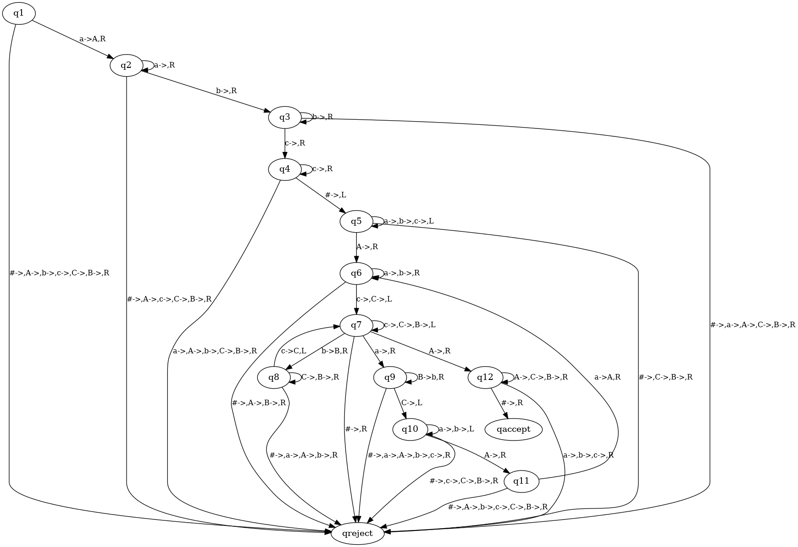

# Turing Machine

这是一份可计算性与计算复杂性的大作业留档

---

### Install
如果你是Debian/Ubuntu环境，你可以用下面的语句来安装所需环境。
```
sudo apt-get install graphviz graphviz-dev
pip install -r requirements.txt
```
如果你是Windows环境，你需要在到 [Graphviz](https://graphviz.org/download) 官网下载 msi 文件，并将添加至环境变量。
然后用下面的语句来安装python所需环境。
```
pip install -r requirements.txt
```
如果你是MacOS环境，你可以用下面的语句来安装所需环境。
```
brew install graphviz
pip install -r requirements.txt
```

### Experiment
实验1：Experiment1.py

你可以用下面的语句来运行该程序
```
python3  Experiment1.py
```


实验1的转移函数图

---

实验2：Experiment1.py

你可以用下面的语句来运行该程序
```
python3  Experiment2.py
```



实验2的转移函数图