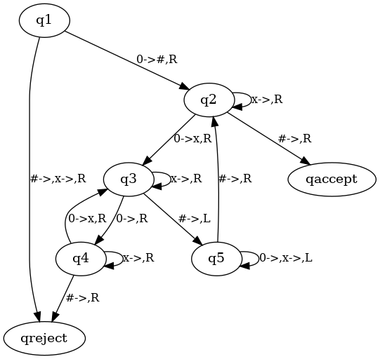

# PyTuringMachine

It's a homework of computability and computational complexity.

---

### Install
If the system is Debian/Ubuntu, you can use the following statement to install the required environment.
```
sudo apt-get install graphviz graphviz-dev
pip install -r requirements.txt
```
If the system is Windows,
you need to download the msi file from the official website of [Graphviz](https://graphviz.org/download) and add it to your environment variables. Then use the following statement to install the required environment for python.
```
pip install -r requirements.txt
```
If the system is MacOS, you can use the following statement to install the required environment.
```
brew install graphviz
pip install -r requirements.txt
```

### Experiment
Experiment 1：Experiment1.py

You can run the program with the following statement.
```
python3  Experiment1.py
```



Plot of transfer function for experiment 1

---

Experiment2：Experiment2.py

You can run the program with the following statement.
```
python3  Experiment2.py
```


Plot of transfer function for experiment 2